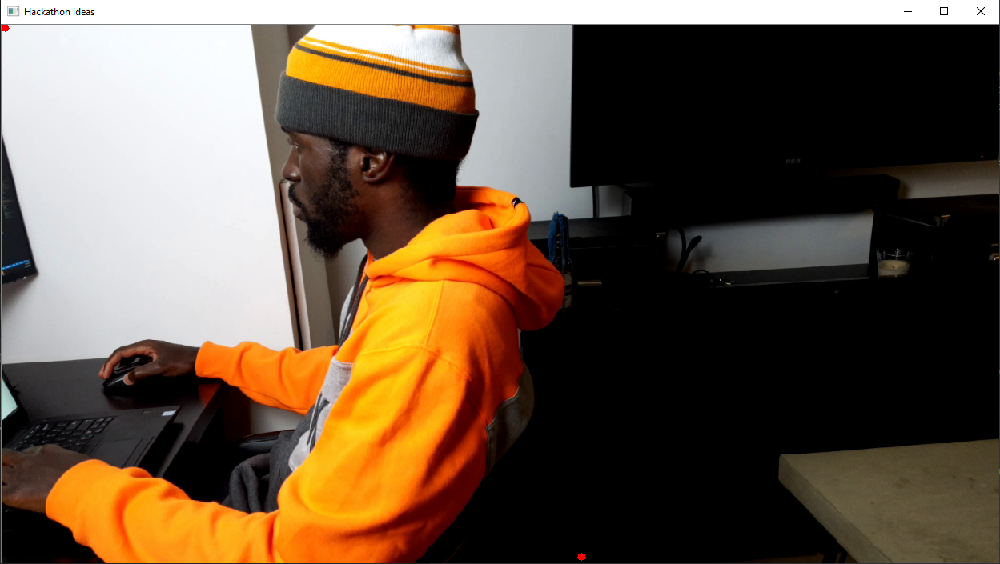
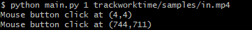
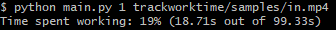
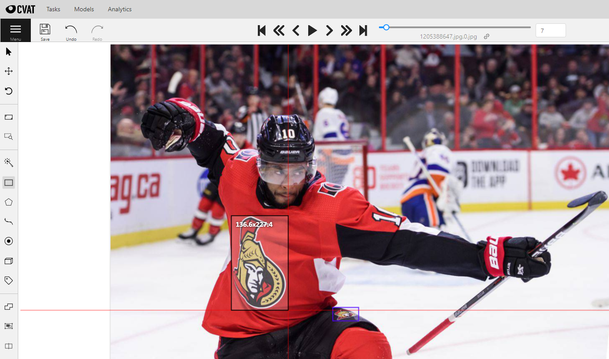
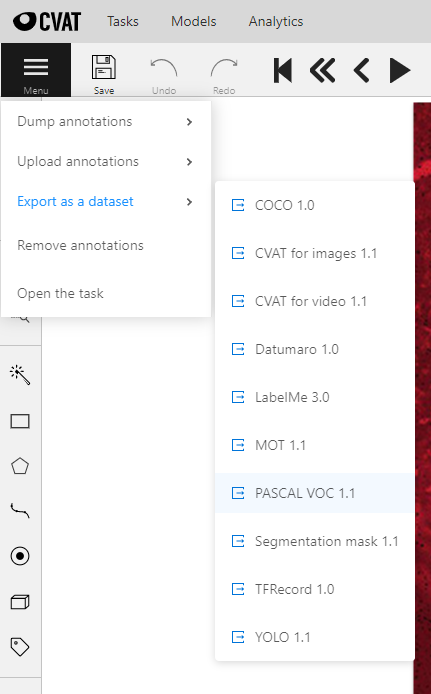
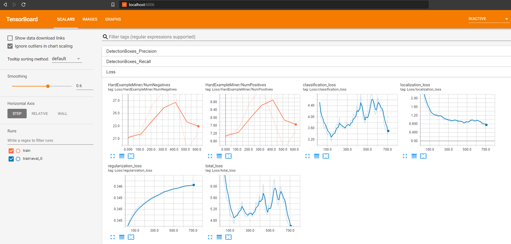

# Hackathon Ideas

## Demo

TODO: Put link to demo video here

## Ideas

### Track Work Time

Keep track of the amount of time you are in your work position using object detection.

#### Dependencies

1. [Python](https://www.python.org/downloads/)

2. [OpevCV](https://opencv.org/releases/)

#### Instructions

1. Run the app on your video: `python main.py 1 trackworktime/samples/in.mp4`.

2. Press `p` to pause the video at the point you want to define the work position.

3. The work position will be a rectangle. You will need to define two points to define that rectangle. On the paused video click where the top left corner of the rectangle will be then click where the bottom right corner will be (see red dots in the image below). 

    

4. Press `ESC` to exit the video.

5. The coordinates of the points you clicked will be printed in the console in the following format: `(pt1, pt2)`. 

    

6. Update the `workTracker.workPosition` value in the file [app.settings.json](app.settings.json) based on the points you clicked in the following format: `pt1-top-left,pt2-top-left,pt1-bottom-right,pt2-bottom-right`.

7. Run the track work time app on your video again to see how the work position is matched with the person detected. You may need to tweek the work position value in [app.settings.json](app.settings.json).

8. The total time spent in the work position will be printed in the console once the app exits.

    

### Spot Brand Loyalty

Identify a brand's text logo in a video for the purpose of identifying brand loyalty.

#### Dependencies

1. [Python](https://www.python.org/downloads/)

2. [OpevCV](https://opencv.org/releases/)

3. [Tesseract OCR](https://github.com/tesseract-ocr/tesseract)

4. [FuzzyWuzzy](https://github.com/seatgeek/fuzzywuzzy)

    ```
    pip install fuzzywuzzy
    ```

#### Instructions

1. In the list `brandSpotter.brands` in [app.settings.json](app.settings.json) insert a list of brands you want to identify.

2. Run the brand spotter app on your video: `python main.py 2 spotbrandloyalty/samples/in.mp4 --out spotbrandloyalty/samples/out-8-blur-thresh.mp4 --ocr_psm 8 --ocr_preproc_blur --ocr_preproc_thresh --ocr_padding 0.05`

#### References

- [PyImageSearch - Tesseract OCR with Python](https://www.pyimagesearch.com/2018/09/17/opencv-ocr-and-text-recognition-with-tesseract/)
- [Learn OpenCV - Text Detection](https://www.learnopencv.com/deep-learning-based-text-detection-using-opencv-c-python/)
- [OpenCV - Text Detection](https://github.com/opencv/opencv/blob/master/samples/dnn/text_detection.py)

### Identify Team Allegiance

Identify a person's sports team allegiances by detecting sports logos in their video feed.

#### Dependencies

1. [Python](https://www.python.org/downloads/)

2. [OpevCV](https://opencv.org/releases/)

3. TensorFlow's object detection API dependencies:

    ```
    pip install tensorflow
    pip install Cython
    pip install pillow
    pip install lxml
    pip install matplotlib
    ```

4. Google's protobuf (TensorFlow git repository) release:

    ```
    cd c:\code
    mkdir tensorflow
    cd tensorflow
    clone https://github.com/tensorflow/models.git
    cd models/research/directory
    
    python setup.py build
    python setup.py install

    cd slim
    pip install -e .
    ```

5. [philferriere's](https://github.com/philferriere) COCO API fork:

    ```
    cd c:\code
    mkdir philferriere
    cd philferriere
    git clone https://github.com/philferriere/cocoapi.git
    cd cocoapi/PythonAPI
    python setup.py build_ext --inplace
    ```

6. Add TensorFlow API library directories listed below to the `PYTHONPATH` environment variable:
    1. C:\code\tensorflow\models
    2. C:\code\tensorflow\models\research\slim
    3. C:\code\philferriere\cocoapi\PythonAPI

7. Install bazel and build TensorFlow's graph transform tool (using the [WSL](https://docs.microsoft.com/en-us/windows/wsl/install-win10) if on Windows):

    ```
    wget https://github.com/bazelbuild/bazel/releases/download/0.13.0/bazel-0.13.0-installer-linux-x86_64.sh
    chmod +x bazel-0.13.0-installer-linux-x86_64.sh
    ./bazel-0.13.0-installer-linux-x86_64.sh --user

    cd /mnt/c/code/tensorflow/tensorflow
    bazel build tensorflow/tools/graph_transforms:transform_graph
    ```

#### Instructions

##### Training Your Model

1. Gather images with the sports logo you want to detect and annotate the logos using [CVAT](https://github.com/opencv/cvat)

    

2. After annotation is complete export the results in Pascal VOC format.

    

3. Extract the contents of [dnn.zip](identifyteamallegiance/cv/dnn.zip) into a folder called [dnn](identifyteamallegiance/cv/dnn). The directory and file structure should look like the following:

    ```
    cv  
    |-- dnn  
    |   |-- data  
    |   |   |-- training  
    |   |   |   |-- data  
    |   |   |   |-- models  
    |   |   |   |   |-- model  
    |   |   |   |   |   |-- train  
    |   |   |   |   |   |-- ssd_mobilenet_v1_coco.config  
    |   |   |   |-- ssd_mobilenet_v1_coco_2017_11_17  
    |   |   |   |   |-- checkpoint  
    |   |   |   |   |-- frozen_inference_graph.pb  
    |   |   |   |   |-- model.ckpt.data-00000-of-00001  
    |   |   |   |   |-- model.ckpt.index  
    |   |   |   |   |-- model.ckpt.meta  
    |   |   |   |   |-- ssd_mobilenet_v1_coco_2017_11_17.pbtxt  
    ```

4. Create a file called [label_map.pbtxt](identifyteamallegiance/cv/dnn/data/training/data/label_map.pbtxt) in [identifyteamallegiance/cv/dnn/data/training/data/](identifyteamallegiance/cv/dnn/data/training/data/) with the contents below.

    ```
    item {  
        id: 1  
        name: 'logo'  
    }
    ```

5. Create the TFRecord training files required to train your model by running the command below. The `--pascal_voc_dir` option is the location of your Pascal VOC annotation extract from CVAT.  
`python main.py 3 identifyteamallegiance/cv/dnn/data/ --pascal_voc_dir identifyteamallegiance/cv/dnn/data/annotations/pascal-voc-1.1 --bnbbox_xml_idx 2 --train`

6. In command prompt `cd` into your local tensorflow repository, e.g. `cd tensorflow/models/research` and run the command to start model training:   
`python object_detection/model_main.py --pipeline_config_path=C:\path\to\sem-onyalo\hackathon-ideas\identifyteamallegiance\cv\dnn\data\training\models\model\ssd_mobilenet_v1_coco.config --model_dir=C:\path\to\sem-onyalo\hackathon-ideas\identifyteamallegiance\cv\dnn\data\training\models\model\train --num_train_steps=50000 --sample_1_of_n_eval_examples=1 --alsologtostderr`

7. Open a second command prompt window, `cd` into your local tensorflow repository, and run the command below to monitor the training process. Once the monitor process is running you can view the training progress in your browser, default: [http://localhost:6006](http://localhost:6006).   
`tensorboard --logdir=C:\code\sem-onyalo\hackathon-ideas\identifyteamallegiance\cv\dnn\data\training\models\model`  

    

8. Model steps will be saved in [identifyteamallegiance/cv/dnn/data/training/models/model/train/](identifyteamallegiance/cv/dnn/data/training/models/model/train/). Once you are satisfied with your model you can export the desired model step.

    ```
    cd c:\code\tensorflow\models\research

    python object_detection\export_inference_graph.py --input_type=image_tensor --pipeline_config_path=C:\code\sem-onyalo\hackathon-ideas\identifyteamallegiance\cv\dnn\data\training\models\model\ssd_mobilenet_v1_coco.config --trained_checkpoint_prefix=C:\code\sem-onyalo\hackathon-ideas\identifyteamallegiance\cv\dnn\data\training\models\model\train\model.ckpt-<model-step-number> --output_directory=C:\code\sem-onyalo\hackathon-ideas\identifyteamallegiance\cv\dnn\data\training\models\model\export
    ```

9. Transform the exported model in your WSL shell. You may need to clear the [model directory](core/models/mobilenet_ssd_v1_sports).

    ```
    cd /mnt/c/code/tensorflow/tensorflow

    bazel-bin/tensorflow/tools/graph_transforms/transform_graph --in_graph=/mnt/c/code/sem-onyalo/hackathon-ideas/identifyteamallegiance/cv/dnn/data/training/models/model/export/frozen_inference_graph.pb --out_graph=/mnt/c/code/sem-onyalo/hackathon-ideas/core/models/mobilenet_ssd_v1_sports/frozen_inference_graph.pb --inputs=image_tensor --outputs="num_detections,detection_scores,detection_boxes,detection_classes" --transforms="fold_constants(ignore_errors=True)"
    ```

10. Create the .pbtxt file that OpenCV needs to run your model.

    ```
    cd c:\code\opencv\opencv

    python samples\dnn\tf_text_graph_ssd.py --input=C:\code\sem-onyalo\hackathon-ideas\core\models\mobilenet_ssd_v1_sports\frozen_inference_graph.pb --output=C:\code\sem-onyalo\hackathon-ideas\core\models\mobilenet_ssd_v1_sports\ssd_mobilenet_v1_sports_2020_10_04.pbtxt --num_classes=1
    ```

11. Ensure that the config path for `mobilenet_ssd_v1_sports` in [ModelManager.py](core\ModelManager.py) matches the .pbtxt file you created in the above step.

##### Running Object Detection

1. Run the app on your video: `python main.py 3 identifyteamallegiance/samples/in.mp4 --score_threshold 0.95`. You may need to override the score threshold depending on the accuracy of your model.

#### References

- [How to train your own Object Detector with TensorFlow’s Object Detector API](https://towardsdatascience.com/how-to-train-your-own-object-detector-with-tensorflows-object-detector-api-bec72ecfe1d9)
